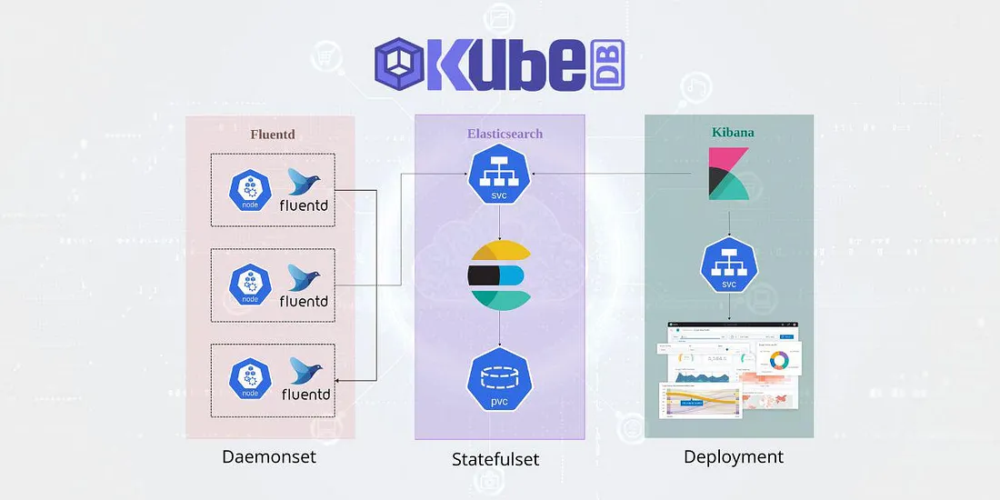

# Deploying-a-Three-Tier-Application-on-AWS-EKS-with-EFK-Logging
This guide to deploying a three-tier application on AWS Elastic Kubernetes Service (EKS) with centralized logging using the EFK (Elasticsearch, Fluentd, Kibana) stack. The project is divided into two parts: setting up the infrastructure and deploying the application, followed by advanced configurations and logging. Each step is explained clearly to ensure you can follow along and implement the solution.
https://medium.com/towards-aws/step-by-step-guide-to-deploying-a-three-tier-application-on-aws-eks-with-efk-logging-3c84503121bd
